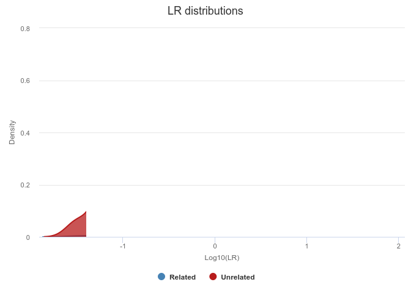

## Installation

The goal of mispitools is to bring a simulation framework for decision
making in missing person identification cases. You can install the
released version of mispitools from [CRAN](https://CRAN.R-project.org)
with:

## Example

This is an example based on a grandchild identification, first you
should do the simulations:

``` r
library(mispitools)
```

    ## Registered S3 method overwritten by 'quantmod':
    ##   method            from
    ##   as.zoo.data.frame zoo

``` r
library(forrel)
```

    ## Loading required package: pedtools

``` r
x = linearPed(2)
x = setMarkers(x, locusAttributes = NorwegianFrequencies[1:5])
x = profileSim(x, N = 1, ids = 2)[[1]]
datasim = makeLRsims(x, missing = 5, 1000, 123)
```

Once obtained, false postive (FPR) and false negative rates (FNR) could
be computed. This allows to calculate Matthews correlation coefficient
for a specific LR threshold (T):

``` r
Trates(datasim, 10)
```

    ## [1] "FNR = 0.643 ;  FPR = 0.007 ;  MCC = 0.453550555147774"

Likelihoold ratio distributions under both hypothesis, relatedness and
unrelatedness could be plotted.

``` r
LRdist(datasim)
```



Decision plot brings the posibility of analyzing FPR and FNR for each LR
threshold.

``` r
deplot(datasim)
```


Decision threshold could be calculated. For further reading please see
DOI: 10.1016/j.fsigen.2021.102519

``` r
DTsim(datasim, 10)
```

    ## [1] "Decision threshold is: 5"

Please cite this tool as: Marsico, F. L., Vigeland, M. D., Egeland, T.,
& Piñero, M. H. (2021). Making decisions in missing person
identification cases with low statistical power. Forensic science
international: genetics, 102519.
