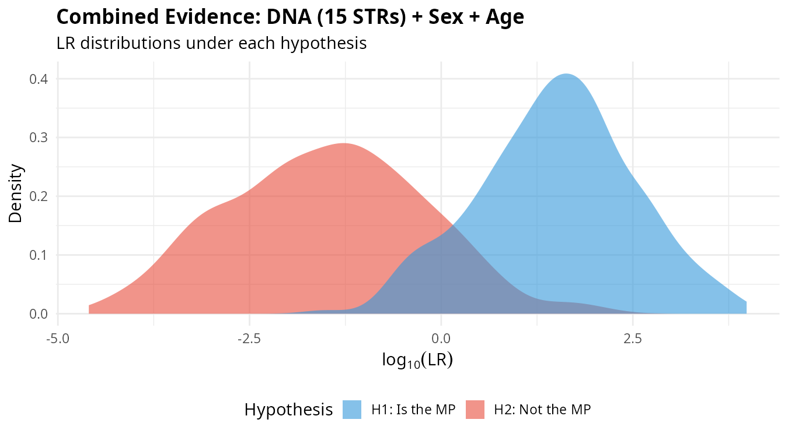
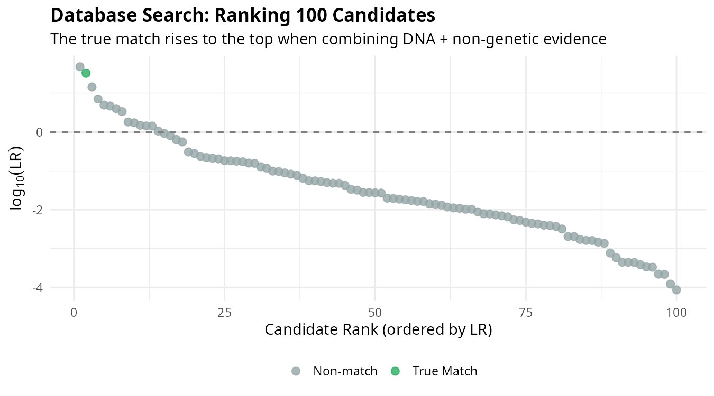

# mispitools: Likelihood Ratios in Forensic Sciences

<!-- badges: start -->
[](https://CRAN.R-project.org/package=mispitools)
[](https://cran.r-project.org/package=mispitools)
<!-- badges: end -->

<br clear="left"/>

## The Problem

Thousands of people go missing every year worldwide. In many cases, unidentified human remains are recovered but cannot be immediately linked to a missing person. Forensic scientists face the challenge of searching databases of missing persons to find potential identifications.

**The core question is: given a set of unidentified remains and a database of missing persons, how do we quantify the weight of evidence for or against a proposed identification?**

Traditional approaches often rely on arbitrary thresholds or subjective assessments. **mispitools** provides a rigorous statistical framework based on likelihood ratios (LRs) that:

- Quantifies the evidential value of both genetic (DNA) and non-genetic information
- Combines multiple independent evidence sources in a coherent Bayesian framework
- Enables informed decision-making by analyzing error rates at different thresholds
- Supports database searches by ranking candidates according to evidential support

## Why Likelihood Ratios?

The likelihood ratio is the gold standard for evidence evaluation in forensic science. Rather than providing a binary "yes/no" answer, the LR tells us how much the evidence should change our belief about an identification.

We evaluate evidence under two competing hypotheses:

- **H1**: The person of interest (POI) **is** the missing person (MP)
- **H2**: The POI is **not** the MP (is an unrelated individual from the population)

$$LR = \frac{P(\text{Evidence} \mid H_1)}{P(\text{Evidence} \mid H_2)}$$

- **LR > 1**: Evidence is more probable if the POI is the MP
- **LR < 1**: Evidence is more probable if the POI is not the MP
- **LR = 1**: Evidence is uninformative

The LR is **not** a probability of identification. It measures the relative support provided by the evidence, which can then be combined with prior information to make decisions.

## Installation

```r
# From CRAN
install.packages("mispitools")

# Development version
devtools::install_github("MarsicoFL/mispitools")
```

## Tutorial: A Complete Workflow

Consider a realistic scenario: a family reports a person missing, and investigators need to search a database of unidentified individuals. The family provides a DNA sample from a relative (e.g., a grandparent), and investigators have information about the missing person's physical characteristics.

### Step 1: Genetic Evidence

We simulate LR distributions from DNA evidence. This requires defining a pedigree structure connecting the MP to the reference individual who provided a DNA sample.

```r
library(mispitools)
library(forrel)
library(pedtools)

# Define pedigree: grandparent-grandchild relationship
ped <- linearPed(2)  # 3-generation pedigree
ped <- setMarkers(ped, locusAttributes = NorwegianFrequencies[1:15])
ped <- profileSim(ped, N = 1, ids = 2)  # Simulate reference profile

# Simulate LRs under both hypotheses
lr_dna <- sim_lr_genetic(ped, missing = 5, numsims = 500)
lr_dna_df <- lr_to_dataframe(lr_dna)

head(lr_dna_df)
#>      Related  Unrelated
#> 1  1247.3201  0.0023415
#> 2   892.1547  0.0001823
#> ...
```

The `Related` column contains LRs simulated under H1 (when the POI truly is the MP), while `Unrelated` contains LRs under H2 (when the POI is unrelated).

### Step 2: Non-Genetic Evidence

Physical characteristics such as biological sex, estimated age, and anthropological features also provide evidential value:

```r
# Simulate LR distributions for sex and age
lr_sex <- sim_lr_prelim("sex", numsims = 500)
lr_age <- sim_lr_prelim("age", numsims = 500)

head(lr_sex)
#>    Related Unrelated
#> 1    1.863    0.1052
#> 2    1.863    1.8627
#> ...
```

### Step 3: Combining Evidence

When evidence sources are conditionally independent, their LRs multiply. This is a fundamental property of the Bayesian framework:

```r
# Combine DNA + sex + age
lr_total <- lr_combine(lr_dna_df, lr_sex)
lr_total <- lr_combine(lr_total, lr_age)

# Visualize the combined LR distribution
plot_lr_distribution(lr_total)
```

<p align="center">

</p>

The separation between distributions under H1 (blue) and H2 (red) reflects the discriminating power of the combined evidence. Greater separation means better ability to distinguish between the two hypotheses.

### Step 4: Database Search

In practice, we search databases containing unidentified individuals. Each candidate receives an LR based on all available evidence, and candidates are ranked accordingly:

<p align="center">

</p>

The individual corresponding to the actual MP (blue) rises to the top of the ranking. This demonstrates how combining multiple evidence sources improves our ability to identify the correct individual among many candidates.

### Step 5: Decision Analysis

To convert LRs into decisions, we analyze error rates at different thresholds:

```r
# Find optimal threshold balancing false positives and false negatives
threshold <- decision_threshold(lr_total, weight = 10)

# Examine error rates at this threshold
threshold_rates(lr_total, threshold)
```

The `weight` parameter reflects the relative cost of false positives versus false negatives. In forensic contexts, falsely identifying someone (false positive) is typically considered more serious than failing to identify (false negative).

## Interactive Application

For users who prefer a graphical interface, **mispitools** includes an interactive Shiny application:

```r
mispitools_app()
```

The app provides tools for calculating LRs from non-genetic evidence, visualizing probability tables, and exploring decision thresholds.

## Main Functions

| Function | Purpose |
|----------|---------|
| `sim_lr_genetic()` | Simulate LRs from DNA evidence |
| `sim_lr_prelim()` | Simulate LRs from non-genetic evidence |
| `lr_combine()` | Combine independent evidence sources |
| `lr_to_dataframe()` | Convert genetic LR results to data frame |
| `decision_threshold()` | Find optimal classification threshold |
| `threshold_rates()` | Compute error rates at a given threshold |
| `plot_lr_distribution()` | Visualize LR distributions |
| `mispitools_app()` | Interactive Shiny application |

## Citation

Marsico FL, Vigeland MD, Herrera Pinero F, Egeland T (2021). "Making decisions in missing person identification cases with low statistical power." *Forensic Science International: Genetics*, 52, 102519. https://doi.org/10.1016/j.fsigen.2021.102519

## Related Packages

- [forrel](https://github.com/magnusdv/forrel): Forensic pedigree analysis
- [pedtools](https://github.com/magnusdv/pedtools): Pedigree manipulation

## Authors

**Franco L. Marsico** — Creator and Head Maintainer
[](https://github.com/MarsicoFL)

**Main contributors:**
- Suisei Nakagawa [](https://github.com/SuiseiNakagawa)
- Undral Ganbaatar [](https://github.com/undralg)

## License

GPL-3
