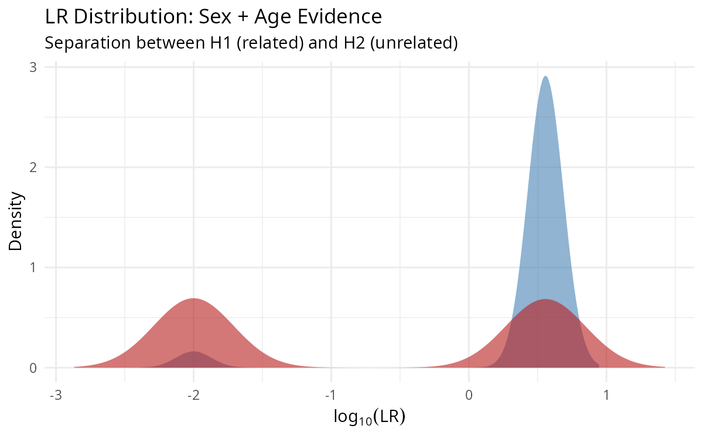
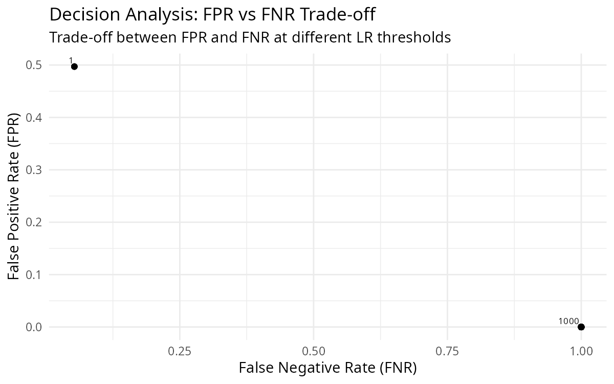
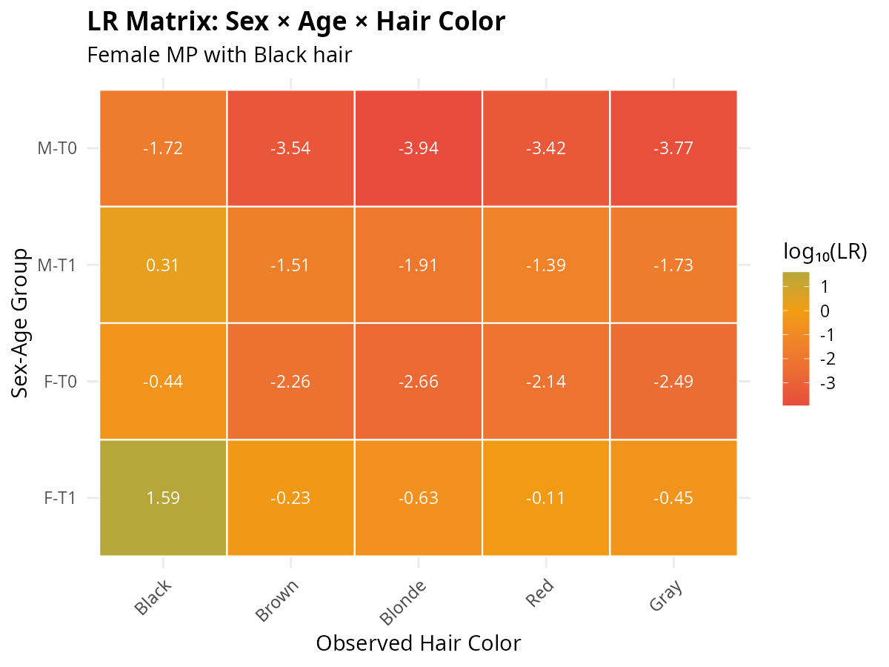
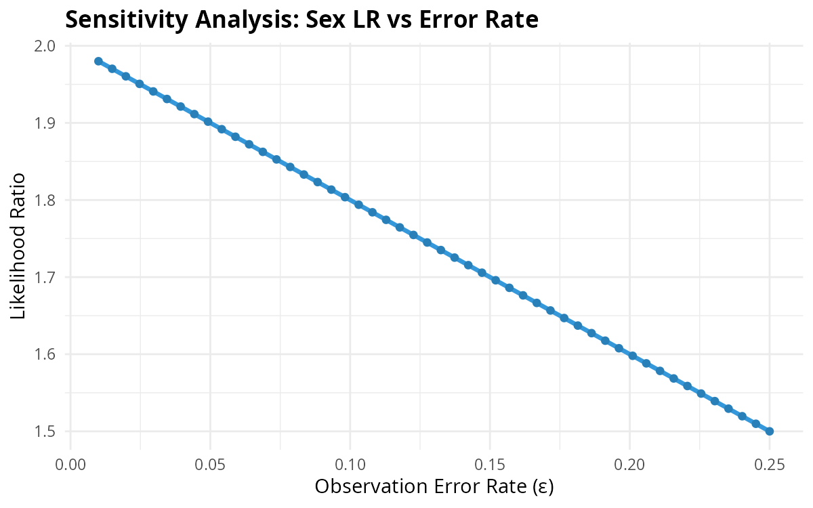
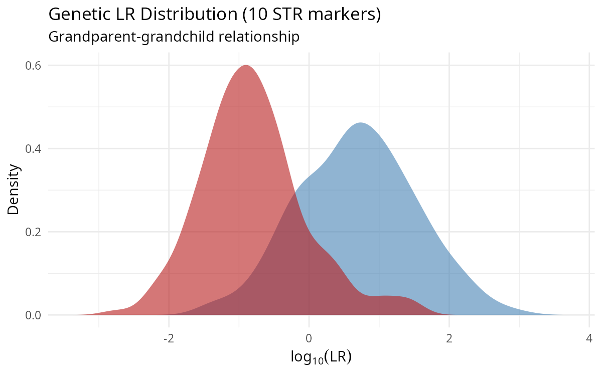

# mispitools: Likelihood Ratios in Forensic Sciences

<!-- badges: start -->
[](https://CRAN.R-project.org/package=mispitools)
[](https://cran.r-project.org/package=mispitools)
[](https://cran.r-project.org/package=mispitools)
<!-- badges: end -->

<br clear="left"/>

## Overview

**mispitools** is an R package for computing likelihood ratios (LRs) in forensic identification cases, with a focus on missing person investigations. It provides tools to evaluate both **genetic (DNA)** and **non-genetic evidence** (biological sex, age, hair color, birth date, geographic region).

### Key Features

- 📊 **LR Calculation** for multiple evidence types
- 🧬 **Genetic + Non-genetic** evidence integration
- 📈 **Simulation** of LR distributions under H1 and H2
- 🎯 **Decision Analysis** with optimal threshold selection
- 🖥️ **Interactive Shiny App** for visualization

---

## Installation

```r
# From CRAN
install.packages("mispitools")

# Development version
devtools::install_github("MarsicoFL/mispitools")
```

---

## Quick Start

```r
library(mispitools)

# Simulate LR distributions for sex and age evidence
lr_sex <- sim_lr_prelim("sex", numsims = 1000)
lr_age <- sim_lr_prelim("age", numsims = 1000)

# Combine evidence
lr_combined <- lr_combine(lr_sex, lr_age)

# Visualize
plot_lr_distribution(lr_combined)
```

---

## Visualizations

### LR Distributions Under H1 vs H2

<p align="center">

</p>

The plot shows the separation between LR distributions when the person **is** the missing individual (H1, blue) versus when they are **not** (H2, red). Greater separation indicates more discriminating evidence.

### Decision Analysis

<p align="center">

</p>

Trade-off between False Positive Rate (FPR) and False Negative Rate (FNR) at different LR thresholds. The optimal threshold balances these errors based on the relative cost of each type of mistake.

### LR Matrix for Combined Evidence

<p align="center">

</p>

Heatmap showing log₁₀(LR) for different combinations of observed characteristics. Green indicates support for H1 (match), red indicates support for H2 (non-match).

### Sensitivity Analysis

<p align="center">

</p>

How the LR changes as model parameters vary. Essential for understanding the robustness of conclusions.

### Genetic Evidence

<p align="center">

</p>

LR distributions from DNA evidence (10 STR markers) for a grandparent-grandchild relationship.

---

## Worked Examples

### Example 1: Non-Genetic Evidence

```r
library(mispitools)

# Scenario: Female MP, age 40±6, observed matching characteristics
set.seed(123)

# Simulate individual LRs
lr_sex <- sim_lr_prelim("sex", numsims = 1000)
lr_age <- sim_lr_prelim("age", numsims = 1000)
lr_region <- sim_lr_prelim("region", numsims = 1000)

# Combine all evidence
lr_total <- lr_combine(lr_sex, lr_age)
lr_total <- lr_combine(lr_total, lr_region)

# Summary statistics
summary(log10(lr_total$Related))   # Under H1
#>    Min. 1st Qu.  Median    Mean 3rd Qu.    Max.
#>  -1.523   0.602   1.041   0.982   1.428   2.193

summary(log10(lr_total$Unrelated)) # Under H2
#>    Min. 1st Qu.  Median    Mean 3rd Qu.    Max.
#>  -2.824  -1.602  -1.000  -0.963  -0.301   1.845

# Optimal decision threshold
threshold <- decision_threshold(lr_total, weight = 10)
#> Decision threshold is: 3.61

# Error rates
rates <- threshold_rates(lr_total, threshold = 3.61)
#> FPR = 0.05, FNR = 0.18, MCC = 0.71
```

### Example 2: Genetic + Non-Genetic Evidence

```r
library(mispitools)
library(forrel)
library(pedtools)

# Create pedigree: grandparent-grandchild
ped <- linearPed(2)
ped <- setMarkers(ped, locusAttributes = NorwegianFrequencies[1:15])
ped <- profileSim(ped, N = 1, ids = 2, seed = 123)

# Simulate genetic LRs
lr_genetic <- sim_lr_genetic(ped, missing = 5, numsims = 500, seed = 123)
lr_genetic_df <- lr_to_dataframe(lr_genetic)

# Simulate non-genetic LRs
lr_prelim <- sim_lr_prelim("sex", numsims = 500)

# Combine genetic + non-genetic
lr_final <- lr_combine(lr_genetic_df, lr_prelim)

# Visualize combined evidence
plot_lr_distribution(lr_final)

# The combination increases discrimination power
```

### Example 3: Conditional Probability Tables

```r
# View probability tables for evidence evaluation
cpt_h1 <- cpt_missing_person(MPs = "F", MPc = 1, eps = 0.05)
cpt_h2 <- cpt_population()

# LR for each observation combination
lr_matrix <- cpt_h1 / cpt_h2
print(round(log10(lr_matrix), 2))
#>        1     2     3     4     5
#> F-T1 1.17  0.20 -0.10 -0.13 -0.03
#> F-T0 0.20 -0.76 -1.06 -1.10 -1.00
#> M-T1 0.17 -0.80 -1.10 -1.13 -1.03
#> M-T0 -0.80 -1.76 -2.06 -2.10 -2.00
```

---

## Interactive Application

Launch the Shiny app for interactive exploration:

```r
mispitools_app()
```

Features:
- Individual evidence calculators
- CPT visualization with heatmaps
- LR distribution simulation
- Evidence combination workflow
- Decision threshold optimization
- Educational tutorials

---

## Function Reference

### LR Calculation

| Function | Evidence Type | Description |
|----------|--------------|-------------|
| `lr_sex()` | Biological sex | LR for sex match/mismatch |
| `lr_age()` | Age range | LR for age within expected range |
| `lr_hair_color()` | Hair color | LR for 5 color categories |
| `lr_birthdate()` | Birth date | LR based on date discrepancy |
| `lr_pigmentation()` | Combined traits | Joint LR for correlated traits |
| `lr_combine()` | Multiple sources | Multiply independent LRs |
| `lr_sensitivity()` | All types | Parameter sensitivity analysis |

### Simulation

| Function | Purpose |
|----------|---------|
| `sim_lr_prelim()` | Simulate non-genetic LR distributions |
| `sim_lr_genetic()` | Simulate DNA-based LR distributions |
| `sim_poi_prelim()` | Generate synthetic POI databases |
| `sim_mp_prelim()` | Generate synthetic MP databases |
| `sim_reference_pop()` | Generate populations with correlated traits |

### Decision Analysis

| Function | Purpose |
|----------|---------|
| `decision_threshold()` | Find optimal LR threshold |
| `threshold_rates()` | Compute FPR, FNR, TPR, TNR, MCC |
| `plot_decision_curve()` | Visualize error trade-offs |
| `plot_lr_distribution()` | Plot H1 vs H2 distributions |

---

## Theoretical Background

### The Likelihood Ratio

The LR quantifies the weight of evidence:

$$LR = \frac{P(E \mid H_1)}{P(E \mid H_2)}$$

Where:
- **H₁**: The unidentified person IS the missing person
- **H₂**: The unidentified person is NOT the missing person
- **E**: Observed evidence

### Interpretation Scale

| log₁₀(LR) | Interpretation |
|-----------|----------------|
| 0 to 1 | Weak support for H1 |
| 1 to 2 | Moderate support for H1 |
| 2 to 4 | Strong support for H1 |
| > 4 | Very strong support for H1 |

Negative values indicate support for H2.

### Evidence Combination

Under conditional independence:

$$LR_{total} = LR_1 \times LR_2 \times \cdots \times LR_n$$

---

## Citation

If you use **mispitools** in your research, please cite:

> Marsico FL, Vigeland MD, et al (2021). "Making decisions in missing person identification cases with low statistical power." *Forensic Science International: Genetics*, 52, 102519. https://doi.org/10.1016/j.fsigen.2021.102519

```bibtex
@article{marsico2021,
  title={Making decisions in missing person identification cases with low statistical power},
  author={Marsico, Franco L and Vigeland, Magnus D and Egeland, Thore and Herrera Pinero, Filipe},
  journal={Forensic Science International: Genetics},
  volume={52},
  pages={102519},
  year={2021},
  doi={10.1016/j.fsigen.2021.102519}
}
```

---

## Related Packages

- **[forrel](https://github.com/magnusdv/forrel)**: Forensic pedigree analysis and kinship LR computation
- **[pedtools](https://github.com/magnusdv/pedtools)**: Pedigree construction and manipulation

---

## License

GPL-3

## Author

**Franco L. Marsico** (maintainer) - franco.lmarsico@gmail.com
