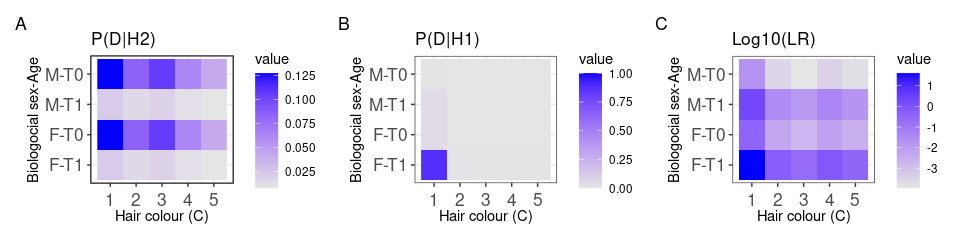
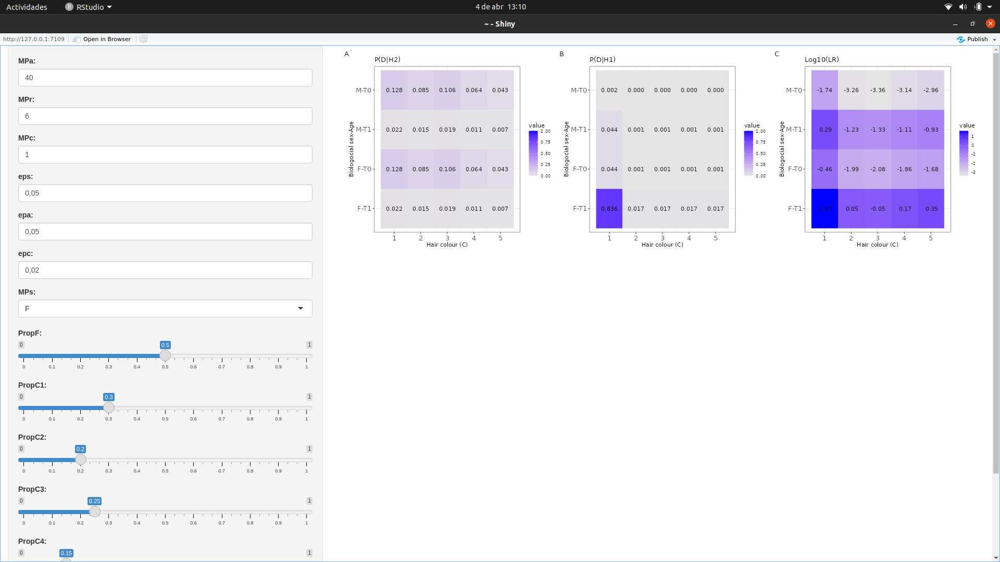
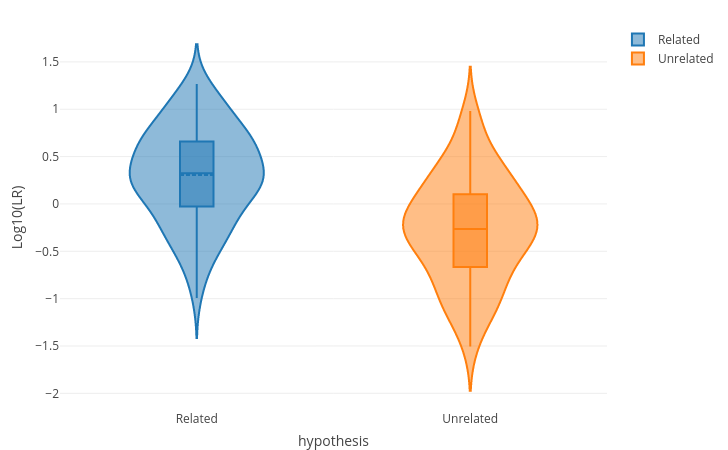
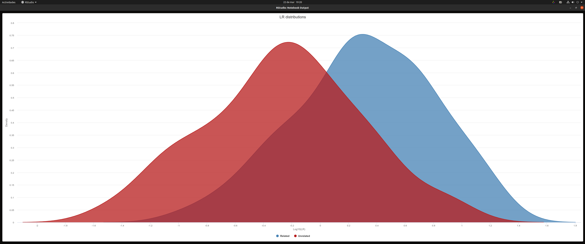
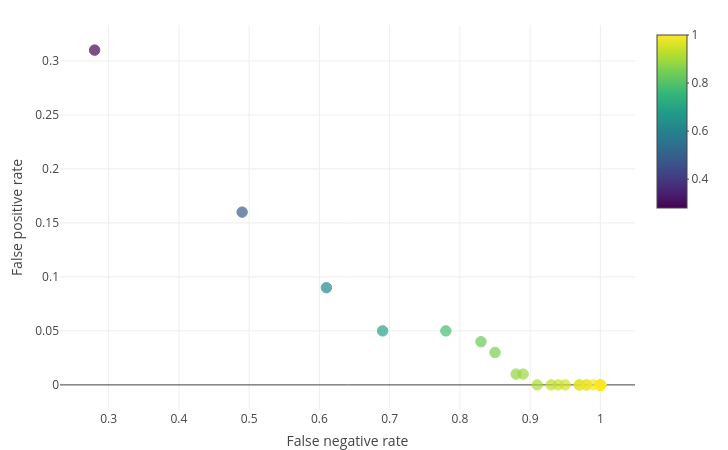
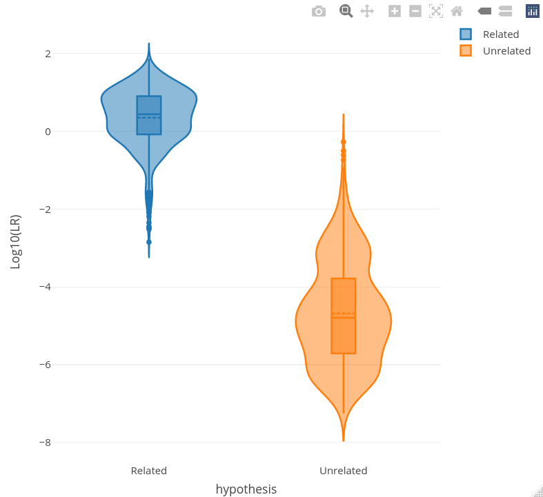

## Mispitools: Missing Person Identification Tools

<!-- badges: start -->

[](https://CRAN.R-project.org/package=mispitools)
[](https://cran.r-project.org/package=mispitools)

<!-- badges: end -->

## About mispitools
'mispitools' is an open-source package written in the R statistical language. It consists of a collection of decision-making tools designed for conducting missing person searches. The package enables the computation of various features, ranging from preliminary investigation data-based likelihood ratios (LRs) to the optimal LR threshold for identifying potential matches in DNA-based database searches.

'mispitools' imports two additional packages, namely forrel (https://doi.org/10.1016/j.fsigen.2020.102376) and pedtools (https://doi.org/10.1016/C2020-0-01956-0).

In its most recent update, 'mispitools' incorporates preliminary investigation data-based LRs, presenting the statistical weight of different traces of evidence, such as biological sex, age, and hair color.

To properly cite 'mispitools,' please refer to the following references: Marsico and Caridi, 2023 (http://dx.doi.org/10.2139/ssrn.4331033), and Marsico, Vigeland et al. 2021 (https://doi.org/10.1016/j.fsigen.2021.102519).


## Installation

The objective of mispitools is to provide a simulation framework for decision-making in missing person identification cases. You can install it from CRAN by typing the following command on your R command line:

``` r
install.packages("mispitools")
library(mispitools)
```

You can also install the unstable versions of mispitools from  [Github](https://github.com/MarsicoFL/mispitools/) by using the following command:

``` r
install.packages("devtools")
library(devtools)
install_github("MarsicoFL/mispitools")
```

Now you can analyze the mispitools documentation, which provides descriptions for all functions and parameters.

```r 
?mispitools
```

NOTE: These packages should be installed automatically as dependencies with mispitools. However, in some cases, it may be necessary to install them manually, especially if you are installing the development version from GitHub. You can do this by using the following lines:

```r 
install.packages("ggplot2")
install.packages("forrel")
install.packages("pedtools")
install.packages("reshape2")
install.packages("tidyverse")
install.packages("patchwork")
```


## Computing LRs for preliminary investigation data
NOTE: The methodology implemented in this section is explained in: http://dx.doi.org/10.2139/ssrn.4331033.

Now you are able to compute conditional probability phenotype tables considering the variables Age, Sex, and Hair color. Firstly, you can analyze the different parameters from the documentation.

``` r
?CPT_POP
```

For simplification, the population reference age distribution is assumed to be uniform. However, the function can be easily adapted to incorporate a dataset with the specified frequencies. This feature will be implemented in the near future.

``` r
CPT_POP(
  propS = c(0.5, 0.5),
  MPa = 40,
  MPr = 6,
  propC = c(0.3, 0.2, 0.25, 0.15, 0.1))
```

    ##        [,1]  [,2]    [,3]    [,4]   [,5]
    ## F-T1 0.0225 0.015 0.01875 0.01125 0.0075
    ## F-T0 0.1275 0.085 0.10625 0.06375 0.0425
    ## M-T1 0.0225 0.015 0.01875 0.01125 0.0075
    ## M-T0 0.1275 0.085 0.10625 0.06375 0.0425

The obtained matrix represents the probabilities of the phenotypes in the reference population. F-T1 represents a female whose age matches with the age of the missing person. F-T0 represents a female with a mismatch in age with the missing person. M-T1 and M-T0 correspond to the same age categories in association with male. The numbers (columns) represent different hair colors. It is important to note that in the following case, the parameters remain the same, but changing the MP (missing person) range will alter the population probabilities.

``` r
CPT_POP(
  propS = c(0.5, 0.5),
  MPa = 40,
  MPr = 15,
  propC = c(0.3, 0.2, 0.25, 0.15, 0.1))
```

    ##         [,1]   [,2]     [,3]     [,4]    [,5]
    ## F-T1 0.05625 0.0375 0.046875 0.028125 0.01875
    ## F-T0 0.09375 0.0625 0.078125 0.046875 0.03125
    ## M-T1 0.05625 0.0375 0.046875 0.028125 0.01875
    ## M-T0 0.09375 0.0625 0.078125 0.046875 0.03125

This can be counterintuitive because the population frequencies remain the same in both cases. However, the values of T1 and T0 depend on the age of the missing person (MP) and the error rate. Similarly, it is possible to compute MP conditioned probabilities. Once again, I recommend referring to the documentation for more details on this process.

``` r
?CPT_MP
```

Then, we can select a specific missing person (MP). One of the parameters is epc, which is derived from the function Cmodel(). Let's take a look at that function:

``` r
?Cmodel()
```

The Cmodel() function provides two options: "uniform" and "custom". The "uniform" option assigns the same error probability (ep) for all combinations of colors, while the "custom" option allows you to specify a specific value for each pair. In this case, we will select the "custom" option.

``` r
Cmodel(
  errorModel = "custom",
  ep = 0.01,ep12 = 0.01,ep13 = 0.005,
  ep14 = 0.01,ep15 = 0.003,ep23 = 0.01,
  ep24 = 0.003,ep25 = 0.01,ep34 = 0.003,
  ep35 = 0.003,ep45 = 0.01)
```

    ##             [,1]        [,2]        [,3]        [,4]        [,5]
    ## [1,] 0.972762646 0.009727626 0.004863813 0.009727626 0.002918288
    ## [2,] 0.009680542 0.968054211 0.004840271 0.009680542 0.002904163
    ## [3,] 0.004897160 0.009794319 0.979431929 0.002938296 0.002938296
    ## [4,] 0.009746589 0.002923977 0.002923977 0.974658869 0.009746589
    ## [5,] 0.002923977 0.009746589 0.002923977 0.009746589 0.974658869

Now we can specify the phenotype probabilities conditioned on the characteristics of the missing person (MP).

``` r
CPT_MP(MPs = "F", MPc = 1, 
       eps = 0.05, epa = 0.05, 
       epc = Cmodel())
```

    ##                1            2            3            4            5
    ## F-T1 0.877918288 8.779183e-03 4.389591e-03 8.779183e-03 2.633755e-03
    ## F-T0 0.046206226 4.620623e-04 2.310311e-04 4.620623e-04 1.386187e-04
    ## M-T1 0.046206226 4.620623e-04 2.310311e-04 4.620623e-04 1.386187e-04
    ## M-T0 0.002431907 2.431907e-05 1.215953e-05 2.431907e-05 7.295720e-06

Moreover, LR can be computed as follows:

``` r
MP <- CPT_MP(MPs = "F", MPc = 1, 
       eps = 0.05, epa = 0.05, 
       epc = Cmodel())
POP <- CPT_POP(
  propS = c(0.5, 0.5),
  MPa = 40,
  MPr = 6,
  propC = c(0.3, 0.2, 0.25, 0.15, 0.1))

MP/POP
```

    ##                1            2            3            4           5
    ## F-T1 39.01859058 0.5852788586 0.2341115435 0.7803718115 0.351167315
    ## F-T0  0.36240177 0.0054360266 0.0021744106 0.0072480354 0.003261616
    ## M-T1  2.05361003 0.0308041505 0.0123216602 0.0410722006 0.018482490
    ## M-T0  0.01907378 0.0002861067 0.0001144427 0.0003814755 0.000171664

We can see that the sex-age-color: F-T1-1 and M-T1-1 are the only two LR
values over 1, being the former (perfect match) the largest. All these
information could be summarized in the following plot:

``` r
library(ggplot2)
CondPlot(POP,MP)
```

<!-- -->

Furthermore, a ShinyApp could be executed using the following command:

``` r
mispiApp()
```
It will open an interactive panel where you can select parameters to compute conditioned probability tables and likelihood ratios (LR) for each phenotype.
The parameter "PropF" represents the proportion of females in the population, and the male proportion is calculated as 1 minus PropF. "PropC" indicates the proportion of a specific hair color. After defining proportions for five hair colors, mispitools normalizes them so that they sum up to 1.

<!-- -->

Note: mispiApp is currently under development. Specifically, the age variable assumes a uniform population frequency distribution from 0 to 80 years old. Introducing inconsistent parameters, such as setting MPa (missing person age) to 40 with a range error (MPr) of 100 (an error that exceeds two times the age and allows negative results), will result in inconsistent probabilities. Please ensure that you select reliable values for accurate calculations.

## Calculating DNA-based decision threshold and error rates
NOTE: The methodology used in this section is explained in: https://doi.org/10.1016/j.fsigen.2021.102519

In this example, forrel and pedtools packages provides the scafold for
pedigree definition and genetic profile simulations.The allele frequency database from Argentina is used,
provided by mispitools.

``` r
library(mispitools)
library(pedtools)
library(forrel)
freq = mispitools::getfreqs(Argentina)[1:5]
x = pedtools::linearPed(2)
x = pedtools::setMarkers(x, locusAttributes = freq)
x = forrel::profileSim(x, N = 1, ids = 2)
plot(x, hatched = typedMembers(x))
```

<!-- -->

Mispitools allows LR distributions simulations considering both, H1: UP
is MP and H2: UP is not MP, as true, as follows:

``` r
datasim = simLRgen(x, missing = 5, 1000, 123)
```

Once obtained, false postive (FPR) and false negative rates (FNR) could
be computed. This allows to calculate Matthews correlation coefficient (MCC)
for a specific LR threshold (T):

``` r
Trates(datasim, 10)
```

    ## [1] "FNR = 0.757 ;  FPR = 0.005 ;  MCC = 0.361063897416207"

Likelihoold ratio distributions under both hypothesis, relatedness and
unrelatedness could be plotted.

``` r
LRdist(datasim, type = 2)
```



Or other plotting option:

``` r
LRdist(datasim, type = 1)
```


Decision plot brings the posibility of analyzing FPR and FNR for each LR
threshold. It could be obtained doing:

``` r
deplot(datasim)
```



This last plot show how different thresholds have different FNR and FPR values. The optimal (named decision threshold, DT) could be computed with the following command:

``` r
DeT(datasim, 10)
```

where 10 is the weight_1 (please see mispitools related papers on the top for further information)


##  The Whole Game: Computing DNA-Based Kinship Test Posterior Odds with Preliminary Investigation Data Based Prior Odds

NOTE: The methodology implemented in this section is explained in: http://dx.doi.org/10.2139/ssrn.4331033.

In this section, we provide a simple code for computing the posterior odds of the genetic step. The prior odds can be based on two models: (i) preliminary investigation data-based prior odds, or (ii) uniform prior odds. The first option assigns specific prior odds for each missing person (MP) and unidentified person (UP) pair, while the second option assigns the same prior odds for all pairs. To access the documentation for further details, please run the following code:

``` r
?postSim
```

As you can see, several parameters correspond to non-genetic LRs simulations, and datasim (output of simLRgen) is taken as the genetic LR simulations. With the following code we can calculate the posteriors of the example analyzed above. 

``` r
Postdata <- postSim(
  datasim, Prior = 0.01, PriorModel = "prelim", 
  eps = 0.05, erRs = 0.01, epc = Cmodel(), 
  erRc = Cmodel(), MPc = 1, epa = 0.05, 
  erRa = 0.01, MPa = 10, MPr = 2
)

LRdist(Postdata, type = 2)
```




You can compare it with the previous violing plot, elucidating the increasement in distribution separation. This would impact on performance metrics, that could be analyzed with the same function (Trates). Also, decision threshold could be setted for posterior odds. 
