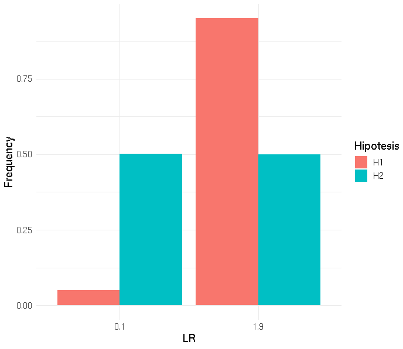
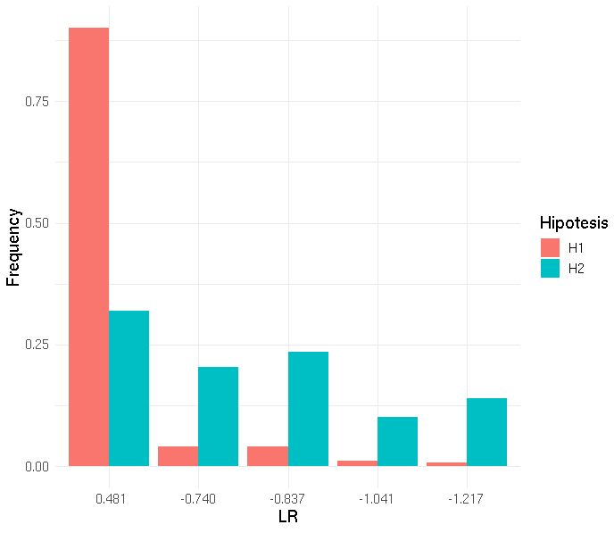

## Mispitools: Missing Person Identification Tools

<!-- badges: start -->

[](https://CRAN.R-project.org/package=mispitools)
[](https://cran.r-project.org/package=mispitools)

<!-- badges: end -->

## About mispitools
'mispitools' is an open source software package written in R statistical language.
It consist in a set of decision making tools to conduct missing person searches. 
Particularly, it allows computing several features, from non-genetic based LRs to optimal LR threshold for declaring potential matches in DNA-based database search.
mispitools imports forrel, https://doi.org/10.1016/j.fsigen.2020.102376, and pedtools packages, https://doi.org/10.1016/C2020-0-01956-0.
More recently 'mispitools' incorporates preliminary investigation data based LRs. Statistical weight of different traces of evidence such as biological sex, age and hair color are presented. 
For citing mispitools please use the following references: Marsico and Caridi, 2023, http://dx.doi.org/10.2139/ssrn.4331033, and  Marsico, Vigeland et al. 2021, https://doi.org/10.1016/j.fsigen.2021.102519.


## Installation

The goal of mispitools is to bring a simulation framework for decision
making in missing person identification cases. You can install it from CRAN typing on your R command line the line presented below:

``` r
install.packages("mispitools")
library(mispitools)
```

You can install too the
versions under development (unstable) of mispitools from [Github](https://github.com/MarsicoFL/mispitools/)
with:
``` r
install.packages("devtools")
library(devtools)
install_github("MarsicoFL/mispitools")
library(mispitools)
```

## Example 1: Using DNA-based identification tools

This is an example based on a grandchild identification, first you
should do the simulations:

``` r
library(mispitools)
library(forrel)
x = linearPed(2)
x = setMarkers(x, locusAttributes = NorwegianFrequencies[1:5])
x = profileSim(x, N = 1, ids = 2)
datasim = simLRgen(x, missing = 5, 1000, 123)
```

Once obtained, false postive (FPR) and false negative rates (FNR) could
be computed. This allows to calculate Matthews correlation coefficient
for a specific LR threshold (T):

``` r
Trates(datasim, 10)
```

    ## [1] "FNR = 0.678 ;  FPR = 0.018 ;  MCC = 0.404650499729402"

Likelihoold ratio distributions under both hypothesis, relatedness and
unrelatedness could be plotted. 

``` r
LRdist(datasim)
```


Decision plot brings the posibility of analyzing FPR and FNR for each LR threshold. 
It could be obtained doing:

``` r
deplot(datasim)
```


Decision threshold could be calculated. For further reading please see
DOI: 10.1016/j.fsigen.2021.102519

``` r
DeT(datasim, 10)
```

    ## [1] "Decision threshold is: 6"

## Example 2: Using preliminary investigation data

It is possible work with preliminary investigation data. We use as example the case of the Abuelas de Plaza de Mayo. It consist in the search of abducted children during the last dictatorship in Argentina. Some function are presented below:

``` r
makePOIprelim()

Output:
    POI-ID        DBD Gender       Birth-type       Birth place
1        1 1977-08-25 female   hospital birth      Buenos Aires
2        2 1979-05-09 female   hospital birth      Buenos Aires
3        3 1976-10-10   male   hospital birth North west region
4        4 1978-04-09 female       home birth           Litoral
5        5 1979-12-11   male   hospital birth              Cuyo
6        6 1978-08-04 female   hospital birth      Buenos Aires
7        7 1977-01-31 female   hospital birth      Buenos Aires
8        8 1976-09-30   male   hospital birth      Buenos Aires
9        9 1979-05-22   male   hospital birth      Buenos Aires
10      10 1978-06-29   male       home birth         Patagonia
...
```

It generates a database of preliminary investigation data. Some features such as gender, declared birth date (DBD), region and type of birth are simulated for a set of persons of interest. Different scenarios of searches could be selected. Also, makeMPprelim() simulates preliminary investigation data for MPs. For instance:

``` r
LRdate()


```
Could be used to compute a likelihood ratio based on birth dates of the missing person (actual birth date or ABD) and for the person of interest (DBD). Methods for LR computations are described here.

Also, in human remain identification cases, some variables such as Age, Sex and hair color are very informative. Therefore, mispitools allows computation of LRs based on these variables. Below, a plot for Sex is shown:

``` r
library(tidyverse)
H1_S <- LRsex(MPs = "F", LR = TRUE, H = 1, nsims = 100000, Ps = c(0.5,0.5), eps = 0.05, erRs = 0.05)
H2_S <- LRsex(MPs = "F", LR = TRUE, H = 2, nsims = 100000, Ps = c(0.5,0.5), eps = 0.05, erRs = 0.05)
H1_S <- mutate(H1_S, Hipotesis = "H1")
H2_S <- mutate(H2_S, Hipotesis = "H2")
Dat <- rbind(H1_S,H2_S)
Dat <- select(Dat, -Sexo)
Dat <- as.data.frame(table(Dat))
Dat <- mutate(Dat, Freq = Freq/100000)

ggplot(Dat, aes(x=LRs, y=Freq, fill=Hipotesis)) + 
  geom_bar(stat="identity", position=position_dodge()) +
  theme_minimal() +
  theme(text = element_text(size = 13)) +
  ylab("Frequency") +
  xlab("LR")
```





Here for hair color:

``` r
CVmod <- Cmodel(errorModel = "custom", ep12 = 0.04, ep13 = 0.04, ep14 = 0.01, ep15 = 0.01, ep23 = 0.01, ep24 = 0.01, ep25 = 0.01, ep34 = 0.03, ep35 = 0.04, ep45 = 0.02)

MP1_H1 <- LRcol(MPc = 1, epc =CVmod, erRc = CVmod, nsims = 1000, Pc = c(0.3,0.25,0.2,0.15,0.1), H= 1, LR=TRUE)
MP1_H1 <- mutate(MP1_H1, Hipotesis = "H1")
MP1_H1 <- mutate(MP1_H1, MPc = "1")

MP1_H2 <- LRcol(MPc = 1, epc =CVmod, erRc = CVmod, nsims = 1000, Pc = c(0.3,0.25,0.2,0.15,0.1), H= 2, LR=TRUE)
MP1_H2 <- mutate(MP1_H2, Hipotesis = "H2")
MP1_H2 <- mutate(MP1_H2, MPc = "1")

X<- rbind(MP1_H1,MP1_H2)
X<- mutate(X, LRc = log10(LRc))
format(round(as.numeric(X$LRc),3))

DatX <- select(X, -Col)
DatX <- as.data.frame(table(DatX))
DatX <- mutate(DatX, Freq = Freq/1000)
DatX <- mutate(DatX, LRc = format(round(as.numeric(as.character(LRc)),3)))


ggplot(DatX, aes(x=LRc, y=Freq, fill=Hipotesis)) + 
  geom_bar(stat="identity", position=position_dodge()) +
  theme_minimal() +
  theme(text = element_text(size = 13)) +
  ylab("Frequency") +
  xlab("LR")
```



And here the combined sex, age and hair variables:

``` r
CPTpop <- CPT_POP()
CPTmp <- CPT_MP()
ConditionalPlot(CPTpop, CPTmp)
```


Please cite this tool as: Marsico, F. L. et al(2021). Making decisions in missing person
identification cases with low statistical power. Forensic science
international: genetics, 102519.
